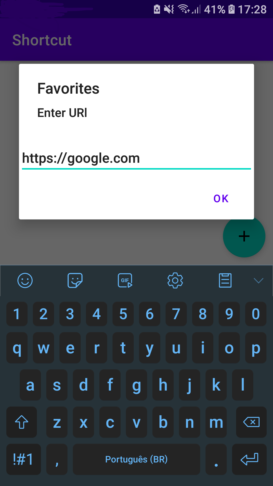
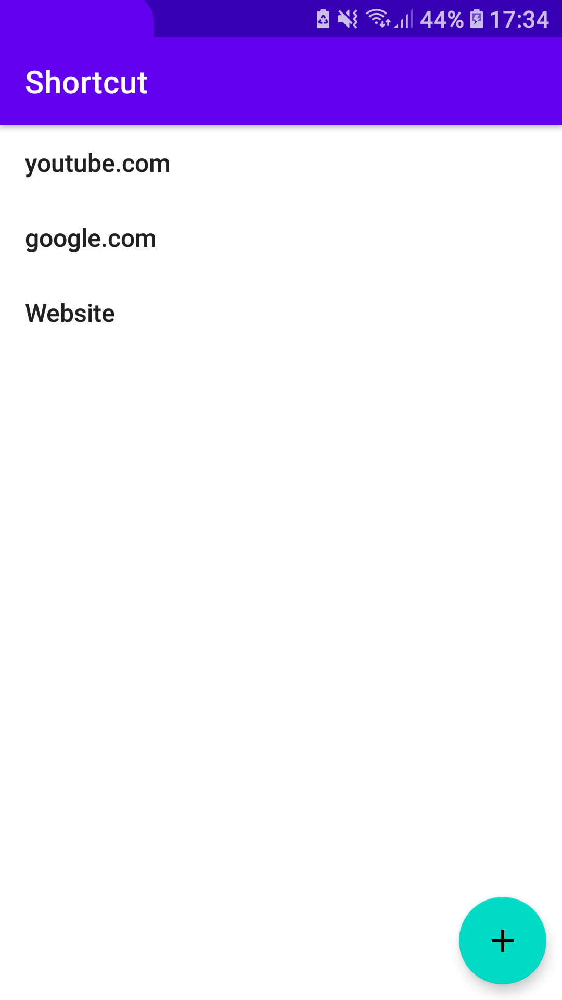
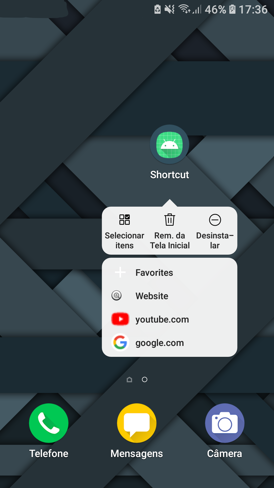

# Shortcuts

:brazil:

Projeto conhecendo e colocando em prática sobre os **Atalhos** ou [Shortcut](https://developer.android.com/guide/topics/ui/shortcuts?hl=pt-br) de aplicativos do Android. Esse projeto foi feito utilizando como tutorial o [Curso Android Express](https://androiddeveloper.com.br/inscricao). O projeto possui duas versões, a versão [Original](https://github.com/Henrique-Santos-da-Silva/Simple-Shortcut-App/tree/main) é a que foi feita seguindo o tutorial do curso e utilizando o [Async Task](https://developer.android.com/reference/android/os/AsyncTask) que está **Deprecated**, e outra versão [Atualizada](https://github.com/Henrique-Santos-da-Silva/Simple-Shortcut-App/tree/with-kotlin-coroutines) que usa [Kotlin Coroutines](https://kotlinlang.org/docs/coroutines-overview.html).

:us:

Project knowing and putting into practice the [Shortcut](https://developer.android.com/guide/topics/ui/shortcuts) of Android applications. This project was made using the [Android Express Course](https://androiddeveloper.com.br/inscricao) as a tutorial in Portuguese. The project has two versions, the [Original](https://github.com/Henrique-Santos-da-Silva/Simple-Shortcut-App/tree/main) version is the one made following the course tutorial and using the [Async Task](https://developer.android.com/reference/android/os/AsyncTask) that is **Deprecated**, and another [Updated](https://github.com/Henrique-Santos-da-Silva/Simple-Shortcut-App/tree/with-kotlin-coroutines) version that uses [Kotlin Coroutines](https://kotlinlang.org/docs/coroutines-overview.html).

## Projeto / Project

    
  
  

